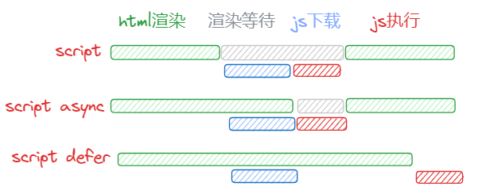

# 浏览器进程与线程

## 线程和进程

> 进程（process）和线程（thread）是操作系统的基本概念

进程是 CPU 资源分配的最小单位（是能拥有资源和独立运行的最小单位）
线程是 CPU 调度的最小单位（是建立在进程基础上的一次程序运行单位）

**一个进程就是一个程序的运行实例**：启动一个程序时，操作系统会为该程序创建一块内存，用来存放代码、运行中的数据和一个执行任务的主线程，我们把这样的一个运行环境叫**进程**

**线程是进程内的一个执行单元**：线程是不能单独存在的，是依附于进程并由进程来启动和管理的

::: tip 进程和线程的关系特点

- 进程是拥有资源的基本单位；线程是调度和分配的基本单位（是进程内的一个执行单元，也是进程内的可调度实体）
- 进程之间相互隔离，互不干扰
- 一个进程中可以并发执行多个线程
- 一个线程只能隶属于一个进程，而一个进程是可以拥有多个线程的（但至少有一个主线程）
- 同一进程的所有线程共享该进程的所有数据
- 进程中的任意一线程执行出错，都会导致整个进程的崩溃
- 当一个进程关闭之后，操作系统会回收进程所占用的内存

:::

## 浏览器是多进程的

有一个主进程，每打开一个 tab 页面都会新开一个进程（某些情况下多个 tab 会合并进程）。

::: danger 在浏览器中打开一个网页相当于新起了一个进程（进程内有自己的多线程）

:::

- **浏览器主进程**：负责界面显示、用户交互、子进程管理，同时提供存储等功能（负责协调、主控）
- **渲染进程**：（浏览器内核）负责将 `HTML` `CSS` 和 `JavaScript` 转换为用户可以与之交互的网页
  - 排版引擎 Blink 和 JavaScript 引擎 V8 都是运行在该进程中
  - 默认情况下 Chrome 会为每个 Tab 标签创建一个渲染进程
  - 出于安全考虑渲染进程都是运行在沙箱模式下
- **GPU 进程**：负责网页、Chrome 的 UI 界面的绘制
- **网络进程**：负责页面的网络资源加载（之前是作为一个模块运行在浏览器进程）
- **插件进程**：负责插件的运行（因为插件易崩溃所以需要通过插件进程来隔离，以保证插件崩溃不会对浏览器和页面造成影响,使用该插件时才创建）

[Chrome 架构：仅仅打开了 1 个页面，为什么有 4 个进程？—— 浏览器工作原理与实践](https://time.geekbang.org/column/article/113513)

## 浏览器内核是多线程的

::: danger 每一个 tab 页面可以看作是浏览器内核的一个进程，然后这个进程是多线程的，它有几大类子线程
:::

- **GUI 渲染线程**：负责渲染浏览器界面，解析 HTML，CSS，构建 DOM 树和 RenderObject 树，布局和绘制等。GUI 渲染线程与 JS 引擎线程是互斥的。
- **JS 引擎线程**：也叫 JS 内核，负责解析执行 JS 脚本程序的主线程，例如 V8 引擎。JS 引擎一直等待着任务队列中任务的到来，然后加以处理，一个 Tab 页（renderer 进程）中无论什么时候都只有一个 JS 线- 程在运行 JS 程序。
- **事件触发线程**：属于浏览器内核线程，主要用于控制事件，例如鼠标、键盘等，当事件被触发时，就会把事件的处理函数推进事件队列，等待 JS 引擎线程执行。
- **定时器触发线程**：主要控制 setInterval 和 setTimeout，用来计时，计时完毕后，则把定时器的处理函数推进事件队列中，等待 JS 引擎线程。
- **异步 http 请求线程**：通过 XMLHttpRequest 连接后，通过浏览器新开的一个线程，监控 readyState 状态变更时，如果设置了该状态的回调函数，则将该状态的处理函数推进事件队列中，等待 JS 引擎线程执行。

## GUI 渲染线程与 JS 引擎线程互斥

- 由于 JavaScript 是可操纵 DOM 的，如果在修改这些元素属性同时渲染界面（即 JS 线程和 UI 线程同时运行），那么渲染线程前后获得的元素数据就可能不一致了。
- 当 JS 引擎执行时 GUI 线程会被挂起，GUI 更新则会被保存在一个队列中等到 JS 引擎线程空闲时立即被执行。

## 渲染过程中遇到 JS 文件如何处理？

- JS 的加载、解析与执行会阻塞文档的解析，也就是说，在构建 DOM 时，HTML 解析器若遇到了 JavaScript，那么它会暂停文档的解析，将控制权移交给 JS 引擎，等 JS 引擎运行完毕，浏览器再从中断的地方恢复继续解析文档。
- 也就是说，如果想要首屏渲染的越快，就越不应该在首屏就加载 JS 文件，这也是建议将 script 标签放在 body 标签底部的原因。当然在当下，并不是说 script 标签必须放在底部，因为你可以给 script 标签添加 defer 或者 async 属性。
  defer 与 async 的区别

## defer 与 async

1. defer 要等到整个页面在内存中正常渲染结束（DOM 结构完全生成，以及其他脚本执行完成），才会执行。多个 defer 脚本，会按照它们在页面出现的顺序加载
2. async 一旦下载完，渲染引擎就会中断渲染，执行这个脚本以后，再继续渲染。多个 async 脚本是不能保证加载顺序的

::: danger defer 是“渲染完再执行”，async 是“下载完就执行”

`async` 更适合于不需要等待页面完整加载即可运行的第三方脚本，因为它提供了更高的灵活性，但可能伴随着一定的执行时机的不确定性。而 `defer` 则是为了确保页面加载完成后才执行脚本，减少因页面未加载完全而引发的错误。

:::
