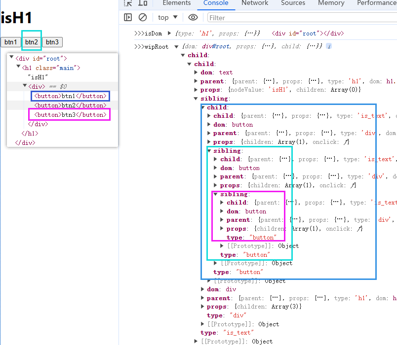

# fiber

React 在首次渲染（执行 ReactDOM.render）时，会通过 React.createElement 创建一颗 Element 树，可以称之为 Virtual DOM Tree，由于要记录上下文信息，加入了 Fiber，每一个 Element 会对应一个 Fiber Node，将 Fiber Node 链接起来的结构成为 Fiber Tree（是个单链表树结构）。它反映了用于渲染 UI 的应用程序的状态。这棵树通常被称为 current 树（当前树，记录当前页面的结构状态）。

### api

`requestIdleCallback` 是一个 Web API，它允许你在主线程上的空闲时段内调度低优先级的任务。这个函数可以确保只在浏览器空闲时执行某些操作，而不会影响到关键的事件

- callback: 必须的参数。一个函数，当浏览器空闲时会被调用。这个函数接收一个参数 deadline，它包含了两个属性：
  1. timeRemaining（返回一个函数，当调用时，它给出本次空闲期还剩余多少毫秒时间）
  2. didTimeout（一个布尔值，表示任务是否因为超过了 timeout 而被迫执行）。
- options: 可选参数。一个包含属性 timeout 的对象，timeout 表示在多久时间内（毫秒计），任务必须被执行，无论是否有空闲时间。

react 用的自己封装的 scheduler

```js
requestIdleCallback(
  (deadline) => {
    while ((deadline.timeRemaining() > 0 || deadline.didTimeout) && tasks.length > 0) {
      doWorkIfNeeded() // 假设这是一个处理任务的函数
    }
  },
  { timeout: 2000 },
)
```

#### vnode 树结构 {#vNode}

creatElement 创建的 vnode 树结构

```json
{
  "type": "h1",
  "props": {
    "className": "main",
    "children": [
      {
        "type": "is_text",
        "props": {
          "nodeValue": "isH1",
          "children": []
        }
      },
      {
        "type": "div",
        "props": {
          "children": [
            {
              "type": "button",
              "props": {
                "children": [
                  {
                    "type": "is_text",
                    "props": {
                      "nodeValue": "btn1",
                      "children": []
                    }
                  }
                ]
              }
            }
          ]
        }
      }
    ]
  }
}
```

:::details 完整代码

```js
let nextUnitOfWork = null,
  currentRoot = null,
  wipRoot = null
function createDom(ele) {
  const dom =
    ele.type === 'is_text' ? document.createTextNode('') : document.createElement(ele.type)
  Object.keys(ele?.props)
    .filter((item) => item !== 'children')
    .forEach((prpName) => (dom[prpName] = ele?.props[prpName])) //添加元素属性 包括自定义属性
  // ele?.props?.children.forEach((item) => render(item, dom));
  return dom
}
//当前firber  跟当前fiber的子节点firber
function reconcileChild(wipFiber, elements) {
  let prevSibling = null
  elements.forEach((element, index) => {
    const newFiber = {
      parent: fiber,
      props: element.props,
      type: element.type,
      dom: null,
    }
    if (index == 0) {
      fiber.child = newFiber
    } else {
      //2.第二次的时候给第一次的兄弟节点赋值 引用关系赋值 prevSibling改变 newFiber也会改变
      prevSibling.sibling = newFiber
    }
    //1.先记录  引用关系赋值
    prevSibling = newFiber
  })
}
// 每一个 element 都是一个 fiber，每一个 fiber 都是一个任务单元
//需要执行每一小块的任务单元  还需要返回下一个任务单元
function performUnitOfWork(fiber) {
  // debugger
  if (!fiber.dom) {
    //没有真实dom  创建
    fiber.dom = createDom(fiber)
  }
  const elements = fiber?.props?.children
  reconcileChild(fiber, elements)
  // return 出下一个任务单元
  //最底层执行完后 往下找兄弟节点
  if (fiber.child) {
    return fiber.child
  }
  let nextfiber = fiber
  while (nextfiber) {
    if (nextfiber.sibling) {
      return nextfiber.sibling
    }
    nextfiber = nextfiber.parent
  }
}

function workLoop(deadline) {
  let showldYield = true
  while (nextUnitOfWork && showldYield) {
    //没有可执行的firber时候没返回值 nextUnitOfWork==undefind
    nextUnitOfWork = performUnitOfWork(nextUnitOfWork)
    showldYield = deadline.timeRemaining() > 1 //得到当前帧剩余时间
    if (!nextUnitOfWork && wipRoot) {
      console.log('>>>wipRoot', wipRoot)
      commitRoot()
    }
    requestIdleCallback(workLoop)
  }
}

function render(ele, container) {
  wipRoot = {
    dom: container,
    props: {
      children: [ele],
    },
  }
  nextUnitOfWork = wipRoot
}

function commitWork(fiber) {
  //递归结束时候传进来的是undefind  直接结束
  if (!fiber) return
  const parentDom = fiber.parent.dom
  parentDom.appendChild(fiber.dom)
  commitWork(fiber.child)
  commitWork(fiber.sibling)
}
function commitRoot() {
  commitWork(wipRoot.child)
  currentRoot = wipRoot
  wipRoot = null
}
requestIdleCallback(workLoop)

export default render
```

:::

### 切片执行

- 浏览器空闲时执行 fiber 链表操作
- deadline 浏览器回调时候提供的 每一帧空余时间查询
- 等待 fiber 树构建好后统一添加到页面

```js
function workLoop(deadline) {
  let showldYield = true
  // 有剩余fiber链表 和空余时间 继续执行
  while (nextUnitOfWork && showldYield) {
    nextUnitOfWork = performUnitOfWork(nextUnitOfWork)
    //得到当前帧剩余时间
    showldYield = deadline.timeRemaining() > 1
    // 等待fiber树构建完成在统一添加dom节点
    if (!nextUnitOfWork && wipRoot) {
      console.log('>>>wipRoot', wipRoot)
      commitRoot()
    }
  }
  requestIdleCallback(workLoop)
}
requestIdleCallback(workLoop)
```

:::tip fiber 树 链表结构
wipRoot 树构建完成后结构如下



<!--  -->

:::

### 创建 fiber 节点

- 将 creatElement 创建的 VNode Tree 转换为 fiber Tree，是个单链表树结构
- 每一个 element 都是一个 fiber，每一个 fiber 都是一个任务单元
- 寻找路径 根找到底 在底兄父 兄父

```js
//需要执行每一小块的任务单元  还需要返回下一个任务单元
function performUnitOfWork(fiber) {
  // debugger
  if (!fiber.dom) {
    //没有真实dom  创建
    fiber.dom = createDom(fiber)
  }
  const elements = fiber?.props?.children
  reconcileChild(fiber, elements)
  // return 出下一个任务单元
  if (fiber.child) {
    return fiber.child
  }
  let nextfiber = fiber
  while (nextfiber) {
    if (nextfiber.sibling) {
      return nextfiber.sibling
    }
    nextfiber = nextfiber.parent
  }
}
```

### 协调构建 firber

目的：

1.  根据当前 firber 绑定**父级**firber
2.  根据当前 firber 绑定**子级**firber
3.  根据当前 firber 绑定**兄弟**firber

```js
//当前firber  跟当前fiber的子节点firber
function reconcileChild(wipFiber, elements) {
  let prevSibling = null
  elements.forEach((element, index) => {
    const newFiber = {
      parent: fiber,
      props: element.props,
      type: element.type,
      dom: null,
    }
    if (index == 0) {
      fiber.child = newFiber
    } else {
      //2.第二次的时候给第一次的兄弟节点赋值 引用关系赋值 prevSibling改变 newFiber也会改变
      prevSibling.sibling = newFiber
    }
    //1.先记录  引用关系赋值
    prevSibling = newFiber
  })
}
```

### 创建真实 dom

[ele 结构](#vNode)

```js
function createDom(ele) {
  const dom =
    ele.type === 'is_text' ? document.createTextNode('') : document.createElement(ele.type)
  Object.keys(ele?.props)
    .filter((item) => item !== 'children')
    .forEach((prpName) => (dom[prpName] = ele?.props[prpName])) //添加元素属性 包括自定义属性
  // ele?.props?.children.forEach((item) => render(item, dom));
  return dom
}
```
