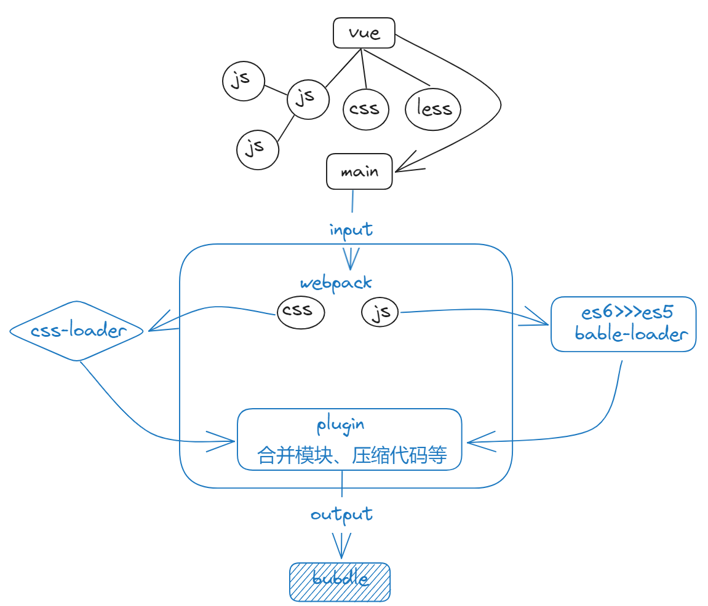
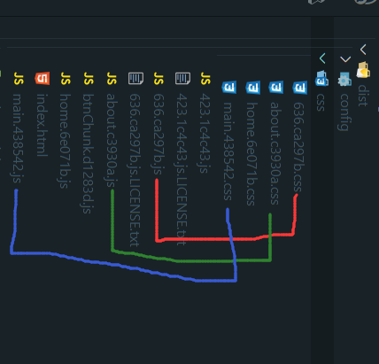
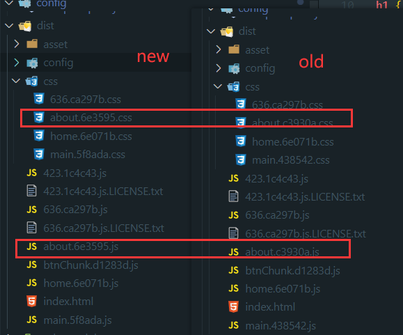
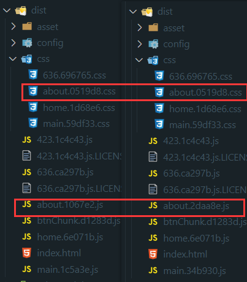
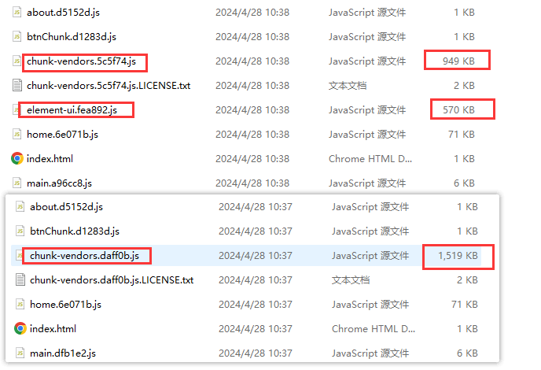
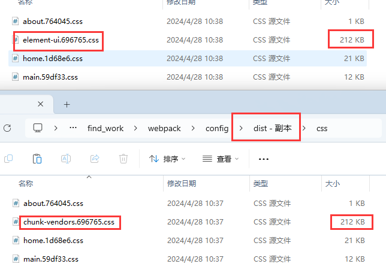

## 电子书

webpack 官网文档写的晦涩，搭配这本电子书阅读更容易理解
[深入浅出 Webpack](http://webpack.wuhaolin.cn)

## 掘金文章推荐

[拆包神技](https://juejin.cn/post/7296665348571791411?searchId=202404281025378D2FDA2CDC818E7CFED1#heading-18)

## 一个完整的 webpack 配置项

[配置项](http://webpack.wuhaolin.cn/2%E9%85%8D%E7%BD%AE/2-8%E6%95%B4%E4%BD%93%E9%85%8D%E7%BD%AE%E7%BB%93%E6%9E%84.html)

## webpack bable loader plugin

1. Loader 主要负责将代码转译为 webpack 可以处理的 JavaScript 代码，(模块源代码的转换和加载)
2. Plugin 更多的是负责通过接入 webpack 构建过程来影响构建过程以及产物的输出
3. Loader 的职责相对比较单一简单，而 Plugin 更为丰富多样
4. Babel 负责代码的语法层面转换
5. Webpack 负责模块的打包与资源整合
   

## 文件监听的原理

- 开启文件监听后，webpack 会**轮询**访问文件的最后修改时间，当发现文件修改时间发生变化后，会先缓存起来等到 aggregateTimeout 再统一执行
- 开启文件监听方式：可以在构建时带上--watch 参数或者设置 watch：true，而 watchOptions 则可以对监听的细节进行定制

## output

### filename

output.filename 配置输出文件的名称，为 string 类型。 如果只有一个输出文件，则可以把它写成静态不变的：
`filename: 'bundle.js'`

但是在有多个 Chunk 要输出时，就需要借助模版和变量了。前面说到 Webpack 会为每个 Chunk 取一个名称，可以根据 Chunk 的名称来区分输出的文件名：
`filename: '[name].js'`
代码里的 [name] 代表用内置的 name 变量去替换[name]，这时你可以把它看作一个字符串模块函数， 每个要输出的 Chunk 都会通过这个函数去拼接出输出的文件名称。

内置变量除了 name 还包括：
| 变量名 | 含义 | 来源层面 |
| --------- | --------------------------- | ---------- |
| id | Chunk 的唯一标识，从 0 开始 | chunk 层面 |
| name | Chunk 的名称 | chunk 层面 |
| hash | Chunk 的唯一标识的 Hash 值 | chunk 层面 |
| chunkhash | Chunk 内容的 Hash 值 | chunk 层面 |
| fullhash | compilation 完整的 hash 值 | 编译层面 |

> 其中 hash 和 chunkhash 的长度是可指定的，[hash:8] 代表取 8 位 Hash 值，默认是 20 位。

```js
 output: {
      filename: "[name].[fullhash:8].js", //打包后的名字  生成8位数的hash
      path: path.resolve(__dirname, "../dist"), //打包的路径
    },
```

查看[webpack filename 参考配置](https://webpack.docschina.org/configuration/output/#template-strings)

## 合理使用缓存

在优化的方案中，缓存也是其中重要的一环。在构建过程中，我们可以通过使用缓存提升二次打包速度。主要有以下几种方式：

### babel-loader 开启缓存

- `cacheDirectory:true` ，存在 node_modules/.cache/babel-loader
- `cacheDirectory:指定路径`

```js
const path = require('path')
const pkg = require('../package.json')
let cachePath = path.resolve(__dirname, `../../cache/${pkg.name}/babel-loader`)
//webpack.config.js
rules: [
  {
    test: /\.js$/,
    use: [
      {
        loader: 'babel-loader',
        options: {
          cacheDirectory: '../cache/babel-loader', //开启缓存
        },
      },
    ],
    exclude: ['/node_modules/'],
  },
]
//vue.config.js
chainWebpack: (config) => {
  config.module
    .rule('compile')
    .test(/\.js$/)
    .use('babel')
    .loader('babel-loader')
    .options({ cacheDirectory: '../cache/babel-loader' }) //bable-loader缓存
}
```

开启前 babel-loader 用时 7.33 {#开启前}

```sh
 SMP  ⏱
General output time took 20.95 secs

 SMP  ⏱  Plugins
BundleAnalyzerPlugin took 1.038 secs
CopyPlugin took 0.067 secs
CleanWebpackPlugin took 0.016 secs

 SMP  ⏱  Loaders
babel-loader took 7.33 secs
  module count = 724
mini-css-extract-plugin, and
css-loader took 2.12 secs
...
```

开启后 babel-loader 用时 3.026

```sh
 SMP  ⏱
General output time took 15.79 secs

 SMP  ⏱  Plugins
BundleAnalyzerPlugin took 0.888 secs
CopyPlugin took 0.039 secs
CleanWebpackPlugin took 0.014 secs

 SMP  ⏱  Loaders
babel-loader took 3.026 secs
  module count = 724
mini-css-extract-plugin, and
css-loader took 0.635 secs
...
```

### webpack5 开启缓存

- `cacheDirectory:true` ，存在 node_modules/.cache/babel-loader
- `cacheDirectory:指定路径`

```js
const path = require("path");
const pkg = require("./package.json");
let cachePath = path.resolve(__dirname, `../../cache/${pkg.name}/dist`);
//webpack.config.js
  cache: {
    type: 'filesystem',
    cacheDirectory: '../cache/dist',
  },
  //vue.config.js
  chainWebpack: (config) => {
  config.cache({
    type: 'filesystem',
    cacheDirectory: '../cache/dist',
  })
  }
```

[开启前](#开启前) 总用时 20.95

开启后 总用时 1.87

```js
 SMP  ⏱
General output time took 1.81 secs

 SMP  ⏱  Plugins
BundleAnalyzerPlugin took 0.857 secs
CopyPlugin took 0.036 secs
CleanWebpackPlugin took 0.016 secs
```

## 按需加载

### js 按需加载

:::tip

很多时候我们不需要一次性加载所有的 JS 文件，而应该在不同阶段去加载所需要的代码。webpack 内置了强大的分割代码的功能可以实现按需加载。

比如，我们在点击了某个按钮之后，才需要使用使用对应的 JS 文件中的代码，我们可以使用 import() 语法按需引入
:::

```js
//impModule.js
export default () => {
  console.log("我是懒加载模块");
};
//使用页面
btnChunkTest() {
      import(/* webpackChunkName: "btnChunk" */ "./utils/impModule").then(
        (fn) => fn.default()
      );
}
```

> 使用魔法棒名称`webpackChunkName`定义模块名称 打包后生成文件名称为`btnChunk.js` 在点击按钮时才会加载模块，才会向服务器发情文件请求

**点击前**
|name|status|type|size|
|:---:|:---:|:---:|:---:|
|bundle.js|200|script|2.3MB|
|main.hashxxx.js|200|script|1.3MB|

**点击后**
|name|status|type|size|
|:---:|:---:|:---:|:---:|
|bundle.js|200|script|2.3MB|
|main.hashxxx.js|200|script|1.3MB|
|btnChunk.js|200|script|1.01kb|

### 路由按需加载

- 不要启用直接导入，用 ipmort 导入就是按需加载
- 打包后 about 会单独打成一个 js 包 在使用 import 页面时才请求 js 文件

```js
// import about from "../views/about.vue";
{
    path: "/about",
    name: "About",
    component: () =>
      import(/* webpackChunkName: "about" */ "../views/about.vue"),
    // component:views
  },
```

### 组件按需加载

同上

## 提前加载 {#提前加载}

上面说的代码懒加载在使用的时候才去加载是会提升页面性能，但是如果懒加载的模块比较大，当我们点击的时候再去加载的话无疑会让用户等待时间加长。
如果可以利用浏览器空闲时候去加载这些切分出来的模块那就好了？
诶，还真有，那就是 prefetch 和 preload
prefetch 和 preload 的概念

### prefetch（预取）

`/priːˈfetʃ/`将来可能需要一些模块资源，在核心代码加载完成之后带宽空闲的时候再去加载需要用到的模块代码。
在魔法注释中添加`webpackPrefetch: true`

```js
// import about from "../views/about.vue";
{
    path: "/about",
    name: "About",
    component: () =>
      import(/* webpackChunkName: "about" ,webpackPrefetch: true*/ "../views/about.vue"),
    // component:views
  },
```

**之前**

`<script defer="" src="main.e24387ae.js"></script>`
|name|status|type|size|
|:---:|:---:|:---:|:---:|
|about.hashxxx.js|200|script|3.6KB|

**之后**

`<script defer="" src="main.e24387ae.js"></script>`

`<link rel="prefetch" as="script" href="http://localhost:8080/about.1210b3f8.js">`
|name|status|type|size|
|:---:|:---:|:---:|:---:|
|about.hashxxx.js|200|script|(prefetch cache)|

### preload（预加载）

- 当前核心代码加载期间可能需要模块资源，其是和核心代码文件一起去加载的。

- preload chunk 会在父 chunk 加载时，以并行方式开始加载。

配置：`import(/* webpackChunkName: "about" ,webpackPreload: true*/ "../views/about.vue"),`

## Gzip

当用户访问 web 站点的时候，会在  request header  中设置  accept-encoding:gzip，表明浏览器是否支持  Gzip。

需要配置服务器

> 一般情况下我们并不会让服务器实时 Gzip  压缩，而是利用 webpack 提前将静态资源进行 Gzip  压缩，然后将 Gzip  资源放到服务器，当请求需要的时候直接将 Gzip  资源发送给客户端。

```js
// npm install compression-webpack-plugin --save-dev

const CompressionPlugin = require('compression-webpack-plugin')

module.exports = {
  plugins: [
    new CompressionPlugin({
      // filename: '[path][base].gz', // 输出压缩文件的名称
      test: /\.(js|css|less)$/, // 匹配文件名
      algorithm: 'gzip', //采用的压缩算法
      threshold: 10240, // 对超过10k的数据压缩
      deleteOriginalAssets: false, // 不删除源文件
      minRatio: 0.8, // 压缩比 默认值0.8
    }),
  ],
}
```

### 分割意义

1. 按需加载

   首次加载只加载必要的内容，提升用户的首次加载的速度。其他的模块可以根据用户的交互进行按需加载，即用户跳转新路由或者点击的页面的时候再进行加载。

2. 有效利用缓存

   通过 webpack 在打包是对代码进行分割，可以有效的利用缓存：打包编译的时候，只需要编译需要更新的部分；用户访问的时候只需要下载被修改的文件即可。
   :::tip 场景

   你有一个体积巨大的文件，并且只改了一行代码，用户仍然需要重新下载整个文件。但是如果你把它分为了两个文件，那么用户只需要下载那个被修改的文件，而浏览器则可以从缓存中加载另一个文件。
   :::

3. 预获取/预加载模块

   参考上述[提前加载](#提前加载)

## 规定编译范围

合理的设置规定 webpack 处理编译范围，能够节约运行构建时候所处理的文件量进而对构建速度和时间进行优化。

- exclude/include (确定 loader 规则范围)
- resolve.modules 指明第三方模块的绝对路径 (减少不必要的查找)
- resolve.extensions 尽可能减少后缀尝试的可能性
- noParse 对完全不需要解析的库进行忽略 (不去解析但仍会打包到 bundle 中，注意被忽略掉的文件里不应该包含 import、require、define 等模块化语句)
- 合理使用 alias

## Chunk 分包规则

### entry 分包处理

- entry 对象，为每一个 entry 单独生成 chunk，之后再根据模块依赖图将 entry 触达到的所有模块打包进 chunk 中。
- 每个 entry 入口对应一个 chunk,比如`main.js`所`import`的所有 js 模块依赖树构成一个 chunk,都会打包进`main.js`的 chunk 中

```js
module.exports = {
  entry: {
    main: './src/main',
    home: './src/home',
  },
}
```

### 异步模块分包

- 用异步语句 require.ensure("./xx.js") 或 import("./xx.js") 方式引入模块，就可以实现模块的动态加载，这种能力本质也是基于 Chunk 实现的。
- 比如各种路由懒加载，

```js
// index.js, entry 文件 这种虽然是入口index构成的chunk 但是触发了规则直接构成一个异步chunk
import 'sync-a'
import 'sync-b'
import('async-c')

//路由import形式
{
    path: "/about",
    name: "About",
    component: () =>
      import(/* webpackChunkName: "about"*/ "../views/about.vue"),
    // component:views
  },

```

## webpck 指纹

:::tip
在 webpack 中，我们可以使用 chunkhash 和 contenthash 这两个选项来生成哈希值。

**chunkhash**：基于每个独立代码块（chunk）的内容生成的哈希值。每个独立代码块都有一个唯一的哈希值。当任何一个模块发生变化时，只有受影响的代码块的哈希值会发生变化，其他代码块的哈希值仍然保持不变。这样，我们可以实现只重新下载发生变化的代码块，而不是整个应用程序的所有代码。

**contenthash**：基于文件内容生成的哈希值。每个文件都有一个唯一的哈希值。无论是应用程序的代码文件、样式文件还是图片等静态资源，只要文件内容发生变化，对应的 contenthash 值就会改变。这样，我们可以确保浏览器能够正确缓存并更新静态资源。
:::

> chunkhash 用于生成文件名中的哈希值，而 contenthash 用于生成文件内容的哈希值。具体使用哪个选项取决于你的 webpack 配置和需求。

### hash

**项目级别**：这是根据整个项目构建生成的 hash 值，只要项目里有文件更改，整个项目构建的 hash 值就会更改，并且全部文件的 hash 值都将改变。可以作为构建版本的指纹。（webpack5 废弃）

> 一整个项目，一次打包，只有一个 hash 值,多入口也是同一个 hash

### chunkhash

**chunk 组级别**
:::tip

- 从入口 entry 出发，到它的依赖，以及依赖的依赖，依赖的依赖的依赖，等等，一直下去，所打包构成的代码块(模块的集合)叫做一个 chunk，也就是说，入口文件和它的依赖的模块构成的一个代码块，被称为一个 chunk。
- 模块路径、模块名称、模块大小、模块 id 等等有关
- 一个入口对应一个 chunk，多个入口，就会产生多个 chunk
- 单入口文件，打包后 chunkhash 和 hash 值是不同的，但是效果是一样的
  :::

  ```js
  output: {
     filename: "[name].[chunkhash:6].js", //打包后的名字  生成8位数的hash
     path: path.resolve(__dirname, "../dist"), //打包的路径
  },
  plugins: [
  //从js中抽离css
     new MiniCssExtractPlugin({
     filename: "css/[name].[chunkhash:6].css",
     }),
  ]
  ```

  这是根据不同的入口文件（Entry）进行依赖文件解析、构建对应的 chunk，生成对应的 hash 值。只有被哪个入口引用到的文件内容才会影响 chunkhash。
  [chunk 分包组织](https://juejin.cn/post/6961724298243342344#heading-0)
  

- main.66a308.js 是入口文件 main.js（导入了 css 样式）构建了一个**入口分包机制**chunk，有自己的 chunkhash 指纹
- about.c3930a.js 是某个路由页面（用了 import 导入组件，启用了懒加载了），有自己的 css，构建了一个**异步模块分包机制**chunk，有自己的 chunkhash 指纹
- home.6e071b.js 是某个路由页面（用了 import 导入组件，启用了懒加载了），有自己的 css，构建了一个**异步模块分包机制**chunk，有自己的 chunkhash 指纹
- 636.ca297b.js 是 splitChunks 提取的 node_modules 下的分包文件，有自己的 css，构建了一个**异步模块分包机制**chunk，有自己的 chunkhash 指纹

我们改变一下 about 页面的内容，css 不变打包后，其他 chunk 的 hash 值不变，但是 css 的 chunkhash 值变了不符合设计


### contenthash

**文件级别的 hash**

这是针对文件内容级别的 hash， 是基于单独文件的内容生成的，只有自身模块的内容变化了，才会影响 hash 改变。通常和 css-loader 搭配使用，用于生成独立的 CSS 文件指纹。

contenthash 很好的解决了我们的问题，当我们设置了 css 输出的指纹用 contenthash 时候，尝试改变 about 页面的内容，此时在打包就能看到只有 js 的 hash 值变了，about 页面没有改变。导入的 css 文件构成了一个 chunk，产生一个 chunkhash,但是 css 用的的指纹用 contenthash，内容没变所以 contenthash 不变

```js
 output: {
    filename: "[name].[chunkhash:6].js", //打包后的名字  生成8位数的hash
    path: path.resolve(__dirname, "../dist"), //打包的路径
 },
 plugins: [
 //从js中抽离css
    new MiniCssExtractPlugin({
    filename: "css/[name].[contenthash:6].css",
    // filename: "css/[name].[chunkhash:6].css",
    }),
 ]
```



:::danger 注意
只有用`@import "../css/about.less";`导入的才会生效。直接写在 vue 文件中无效。
:::

::: details 各种 hash 生成方式

大致的流程：

```js
let crypto = require('crypto')
let content = fs.readFileSync('a.jpg') // 读取文件
let hash = crypto.createHash('md5').update(content).digest('hex').slice(0, 10) // 生成 10 位 hash
```

hash:

```js{16,17}
let crypto = require('crypto');

// 伪代码
let entry = {
    entry1: 'entry1', // 值'entry1'代表entry1这个文件，伪代码
    entry2: 'entry2', // 值'entry2'代表entry2这个文件，伪代码
}

let entry1 = ’require("./depModule1")'; // 代表entry1中引入了depModule1，伪代码
let entry2 = ’require("./depModule2")'; // 代表entry2中引入了depModule2，伪代码

let depModule1 = 'depModule1'; // 代表depModule1的内容是depModule1
let depModule2 = 'depModule2'; // 代表depModule2的内容是depModule2

let hash = crypto.createHash('md5')
			.update(entry1)
			.update(entry2)
			.update(depModule1)
			.update(depModule2)
			.digest('hex');
// 这就说明，webpack的hash是对每个依赖模块进行update得到的，只要任意依赖的模块由改变，那么hash值就会改变

```

chunkhash:

```js{16,17}
let crypto = require('crypto');

// 伪代码
let entry = {
    entry1: 'entry1', // 值'entry1'代表entry1这个文件，伪代码
    entry2: 'entry2', // 值'entry2'代表entry2这个文件，伪代码
}

let entry1 = ’require("./depModule1")’require("./depModule2")'; // 代表entry1中引入了depModule1，伪代码
let entry2 = ’require("./depModule2")'; // 代表entry2中引入了depModule2，伪代码

let depModule1 = 'depModule1'; // 代表depModule1的内容是depModule1
let depModule2 = 'depModule2'; // 代表depModule2的内容是depModule2

let chunkhash_of_entry1 = crypto.createHash('md5')
                            .update(entry1)
                            .update(depModule1)
                            .update(depModule2)
                            .digest('hex');
let chunkhash_of_entry2 = crypto.createHash('md5')
                            .update(entry2)
                            .update(depModule2)
                            .digest('hex');

// 这就说明，webpack的chunkhash是对每个入口自己的依赖模块进行update得到的，每个入口对应一个chunkhash，入口文件和依赖有所改变，那么这个入口对应的chunkhash就会改变

```

coententhash

```js{15,17}
let crypto = require('crypto');

// 伪代码
let entry = {
    entry1: 'entry1', // 值'entry1'代表entry1这个文件，伪代码
    entry2: 'entry2', // 值'entry2'代表entry2这个文件，伪代码
}

let entry1 = ’require("./depModule1")’require("./depModule2")'; // 代表entry1中引入了depModule1，伪代码
let entry2 = ’require("./depModule2")'; // 代表entry2中引入了depModule2，伪代码

let depModule1 = 'depModule1'; // 代表depModule1的内容是depModule1
let depModule2 = 'depModule2'; // 代表depModule2的内容是depModule2

let entry1File1 = entry1 + depModule1;
let entry1File2 = entry1 + depModule2;
let contenthash_of_entry1 = crypto.createHash('md5')
                            .update(entry1File1)
                            .digest('hex');
let contenthash_of_entry2 = crypto.createHash('md5')
                            .update(entry1File2)
                            .digest('hex');

```

:::

## splitChunks 分包

### 分割方式

1. 入口点分割:通过配置多个入口点,Webpack 会为每个入口点生成一个独立的包。
2. 动态导入:通过使用动态导入语句(如 `import()`)，Webpack 会将动态导入的模块分割到一个独立的包中。
3. 更高级的代码分割功能,如使用 `SplitChunksPlugin` 进行公共代码提取。

> splitChunks.chunks 中有三个属性，分别是
>
> - async：只拆分异步导入的模块。
> - initial：只拆分同步导入的模块。
> - all：拆分所有模块，无论是同步还是异步导入的。

[分包参考](https://juejin.cn/post/6961724298243342344#heading-0)

参考配置

```js
// 当我们运行项目并且打包的时候，会发现chunk-vendors.js这个文件非常大，那是因为webpack将所有的依赖全都压缩到了这个文件里面，这时我们可以将其拆分，将所有的依赖都打包成单独的js。
config.optimization = {
  mergeDuplicateChunks: true, // 合并相同的 chunk
  // runtimeChunk: 'manifest',
  // runtimeChunk: 'single',
  splitChunks: {
    chunks: 'all', //表示将选择哪些块进行优化。提供字符的有效值为all、async和initial,默认是仅对异步加载的块进行分割。
    minSize: 100 * 1024, //模块大于minSize时才会被分割出来。默认100k
    maxSize: 0, //生成的块的最大大小，如果超过了这个限制，大块会被拆分成多个小块。
    minChunks: 1, //拆分前必须共享模块的最小块数。
    maxAsyncRequests: 5, //按需加载时并行请求的最大数目。
    maxInitialRequests: 3, //入口点的最大并行请求数
    automaticNameDelimiter: '~', //默认情况下，webpack将使用块的来源和名称（例如vendors~main.js）生成名称。此选项允许您指定要用于生成的名称的分隔符。
    automaticNameMaxLength: 30, //允许为SplitChunksPlugin生成的块名称的最大长度
    name: true,
    cacheGroups: {
      // elementUI: {
      //   priority: 20,
      //   name: 'element-ui',
      //   test: /element-ui/,
      //   reuseExistingChunk: true,
      // },
      vendor: {
        name: `chunk-vendors`,
        test: /[\\/]node_modules[\\/]/, //控制此缓存组选择的模块。省略它将选择所有模块。它可以匹配绝对模块资源路径或块名称。匹配块名称时，将选择块中的所有模块。
        minChunks: 1,
        // maxInitialRequests: 12,
        maxAsyncRequests: 5,
        minSize: 100 * 1024,
        maxSize: 5 * 1000 * 1024,
        priority: -10, //一个模块可以属于多个缓存组,模块出现在优先级最高的缓存组中
      },
      common: {
        name: `chunk-common`,
        minChunks: 2,
        priority: -20,
        chunks: 'initial',
        reuseExistingChunk: true, //如果当前块包含已经从主包中分离出来的模块，那么该模块将被重用，而不是生成新的模块
      },
    },
  },
}
```

### 示例

由于公司用的自己的 ui 库，会经常更新，但是其他三方依赖改动较小，所以在提取了所有三方库的基础上继续抽离 ui 库，在上面的配置参考基础上加上 ui 库的分包配置

```js
elementUI: {
        priority: 20,
        name: 'element-ui',
        test: /element-ui/,
        reuseExistingChunk: true,
      },
```

配置对比结果如下

ui 的 js 从 node_modules 中抽离出来后，其他三方库都抽离到 vendor 中的大小减小了



css 由于三方包除了 ui 库有样式 所以抽离的 css 大小不变


上面对 element-ui 的抽离配置做了优化，但是在三方库中某个依赖变化了 chunk-vendors 会重新分配 hash 值，用户请求会重新下载，我们不可能一个一个去配置
`cacheGroups`组，为了解决这个问题，我们在上面的 vendor 组配置项中去除` name: 'chunk-vendors'`名字配置项就行，等 webpack 自动分配名字，过大的三方包会根据`miniSize`等规范自动分配出来

webpack 对 name 选项的术语解释：
