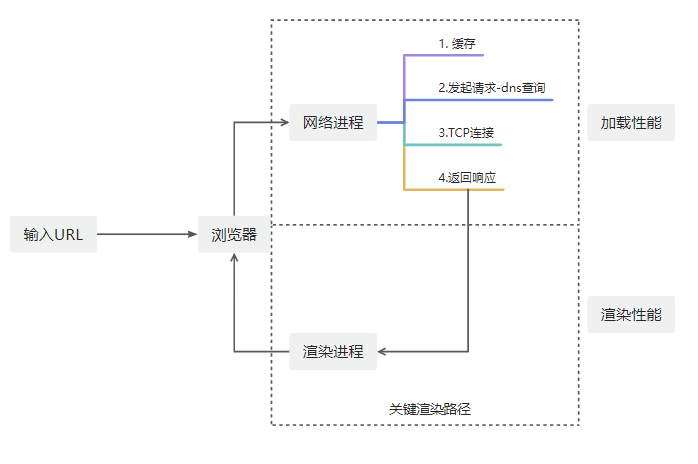

# 性能优化

## 性能指标

衡量首屏性能是评估网页加载和响应速度的重要部分。以下是一些常见的指标及其解释：

### 常见的首屏性能指标

1. **First Contentful Paint (FCP) - 首次内容绘制**

   - **定义**：浏览器首次绘制来自 DOM 的任何内容（比如文本、图像、SVG 等）的时间。
   - **意义**：反映用户开始看到页面内容的时间。

2. **Largest Contentful Paint (LCP) - 最大内容绘制**

   - **定义**：页面在可视区域内最大可见内容的绘制时间，包括图像、视频等块级元素。
   - **意义**：反映首屏主要内容加载完成的时间，是更贴近用户感受的重要指标。

3. **First Paint (FP) - 首次绘制**

   - **定义**：浏览器开始绘制第一个像素的时间点。
   - **意义**：反映渲染过程的开始时间。

4. **Time to Interactive (TTI) - 可交互时间**

   - **定义**：页面主要子资源完成加载且能够快速响应用户输入的时间点。
   - **意义**：用户可真正开始与页面交互的时间。

5. **Total Blocking Time (TBT) - 总阻塞时间**

   - **定义**：从 FCP 到 TTI 期间，长任务（超过 50ms）阻塞主线程的总时间。
   - **意义**：衡量页面加载过程中不可交互的时间总量。

6. **Cumulative Layout Shift (CLS) - 累积布局偏移**
   - **定义**：衡量视觉稳定性，量化页面元素在加载过程中发生位置变化的次数和程度。
   - **意义**：评价用户体验的平稳度，确保页面内容不会意外移动。

### LCP 与 FCP 的区别

- **FCP**：反映页面某部分内容首次对用户可见的时间，但不一定是主要内容。这通常是用户感知页面加载开始的第一个时间点。
- **LCP**：反映页面主要内容首次完全可见的时间，通常是用户感知页面加载完成的时间。这个指标更关注用户真正关心的内容是否已经出现。

### 优化方向

- 减少 JavaScript 和 CSS 的阻塞
- 使用延迟加载（Lazy Loading）技术
- 现代化图像优化（如 WebP 格式）
- 服务端渲染（SSR）或渐

## 加载性能

## 渲染性能
