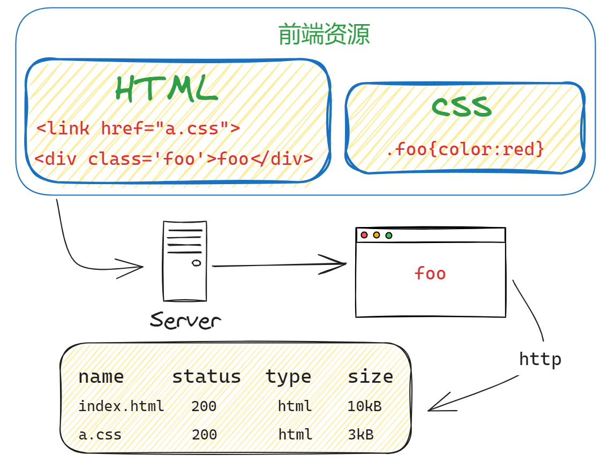
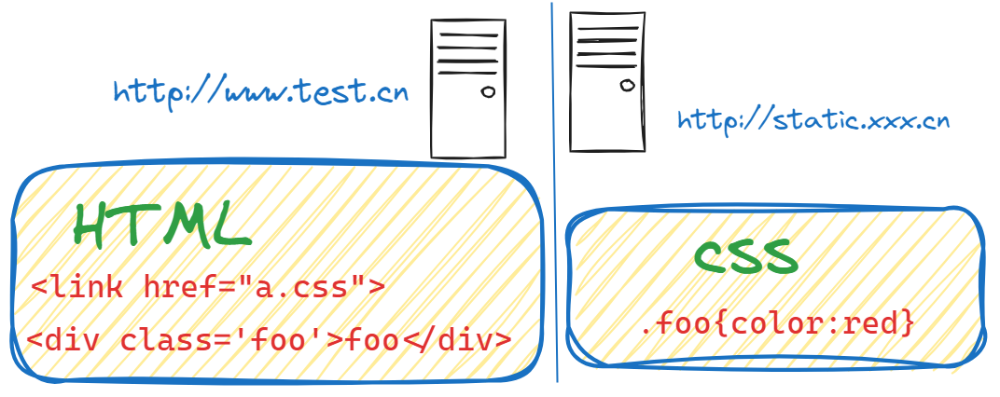
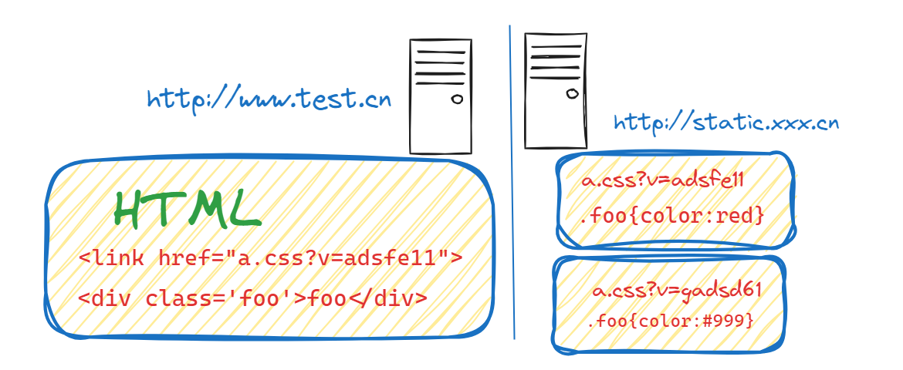

::: tip 前言
现在大部分的中小型公司部署前端代码都是比较简单的，主要步骤如下:
首先，通过脚手架提供的命令 npm run build 打包前端代码，生成 dist 文件夹；
最后，将 dist 文件夹丢给后台开发人员放在他们的工程里面，随后台一起部署；现在普遍是前后端分开部署，因此，利用 nginx 起一个 web 服务器，将 dist 文件夹放到指定的路径下，配置下 nginx 访问路径，对于请求接口使用 proxy_pass 进行转发，解决跨域的问题。
更加高端一点的操作，是利用 CI/CD + Docker 进行自动化部署
:::

## 基础的方式

下图是一个 index.html 页面和它的样式文件 a.css，无需编译，本地预览，丢到服务器，等待用户访问。


## 优化方式

目前存在的问题是每次都要请求 a.css 很浪费带宽啊，我们希望最好这样：利用 304，让浏览器使用本地缓存。
| name | status | type | size |
| --- | --- | --- | --- |
| index.html | 200 | text/html | 1.2K |
| a.css | 304 | text/css | 200B |

但，这样也就够了吗？

不够！

304 叫协商缓存，这玩意还是要和服务器通信一次，我们的优化级别是变态级，所以必须彻底灭掉这个请求，要变成这样：
| name | status | type | size |
| --- | --- | --- | --- |
| index.html | 200 | text/html | 1.2K |
| a.css | 304 | text/css | disk cache |

强制浏览器使用本地缓存(cache-control/expires)，不要和服务器通信。
好了，请求方面的优化已经达到变态级别，那问题来了：你都不让浏览器发资源请求了，这缓存咋更新？
很好，相信有人想到了办法：通过更新页面中引用的资源路径，让浏览器主动放弃缓存，加载新资源。

## 缓存更新

前端构建时采用 contenthash 的方式，若有内容变动，则产生新的 hash 文件名，若没有变动则保持原来的 hash 值（方便缓存）。构建出来的静态资源放到对象存储中，然后前置 CDN 进行缓存。静态资源采用非覆盖式发布，即旧文件依旧存在。

```html
# index.html
<link rel="stylesheet" href="a.css?v=adsfe11" />
<link rel="stylesheet" href="b.css?v=sddse35" />
<link rel="stylesheet" href="c.css?v=hexfa85" />
```

如果 a.css 文件内容变化，那么 a.css 的 url 就会变化，打包后 hash 值变化，html 引用地址发生变化重新请求数据，从而实现缓存的更新。
::: warning 入口文件的缓存
nginx 或后端给 html 文件设置强制不缓存，每次都重新去服务器获取一遍 html 文件，毕竟现在流行的 vue 和 react 的 html 文件就是个入口，没有什么代码量。缓存那一块用 html 文件的 meta 标签设置没用，我个人都是在 nginx 或后端设置
:::

```html
# index.html
<link rel="stylesheet" href="a.css?v=gadsd61" />
<link rel="stylesheet" href="b.css?v=sddse35" />
<link rel="stylesheet" href="c.css?v=hexfa85" />
```

::: tip 动静分布式部署
现代互联网企业，为了进一步提升网站性能，会把静态资源和动态网页分集群部署，静态资源会被部署到 CDN 节点上，网页中引用的资源也会变成对应的部署路径
:::

> 这里的静态资源不仅仅包括 css 文件，也包括图片，以及不怎么经常变的资源。
> 

## 存在的问题

1. 先部署动态页面，再部署静态资源：在二者部署的时间间隔内，如果有用户访问页面，就会在新的页面结构中加载旧的资源，并且把这个旧版本的资源当做新版本缓存起来，其结果就是：用户访问到了一个样式错乱的页面，除非手动刷新，否则在资源缓存过期之前，页面会一直执行错误。
2. 先部署静态资源，再部署动态页面：在部署时间间隔之内，有旧版本资源本地缓存的用户访问网站，由于请求的页面是旧版本的，资源引用没有改变，浏览器将直接使用本地缓存，这种情况下页面展现正常；但没有本地缓存或者缓存过期的用户访问网站，就会出现旧版本页面加载新版本资源的情况，导致页面执行错误，但当页面完成部署，这部分用户再次访问页面又会恢复正常了。

好的，上面一坨分析想说的就是：先部署谁都不成！都会导致部署过程中发生页面错乱的问题。

所以，访问量不大的项目，可以让研发同学苦逼一把，等到半夜偷偷上线，先上静态资源，再部署页面，看起来问题少一些。这也是很多公司的部署方案。

但是，大公司超变态，没有这样的绝对低峰期，只有相对低峰期。

所以，为了稳定的服务，还得继续追求极致啊！

这个奇葩问题，起源于资源的 覆盖式发布，用待发布资源覆盖已发布资源，就有这种问题。

解决它也好办，就是实现 非覆盖式发布。


看上图，用文件的摘要信息来对资源文件进行重命名，把摘要信息放到资源文件发布路径中，这样，内容有修改的资源就变成了一个新的文件发布到线上，不会覆盖已有的资源文件。上线过程中，先全量部署静态资源，再灰度部署页面，整个问题就比较完美的解决了。

[参考 前端部署真的不简单](https://juejin.cn/post/7316202725330796571)
